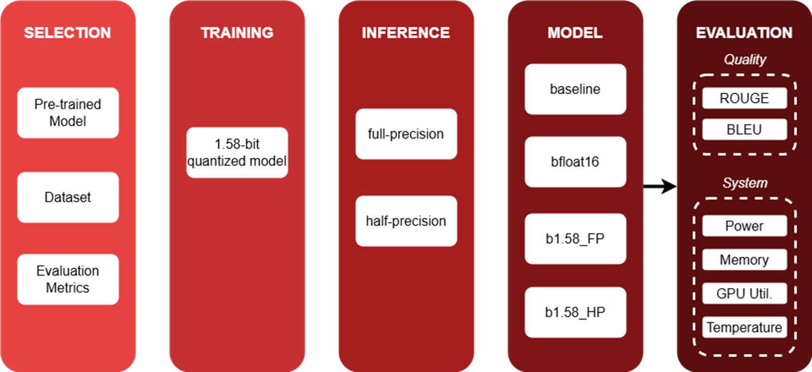
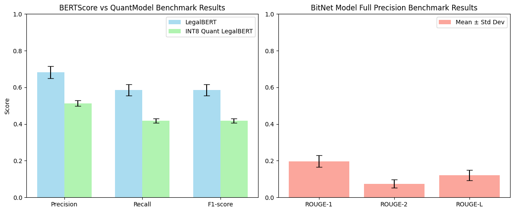
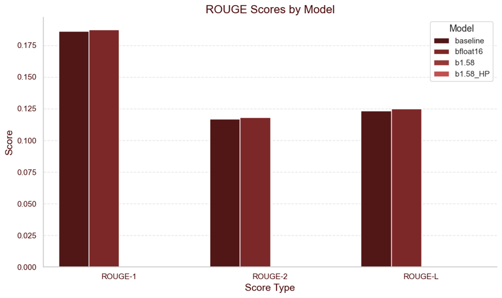

# NLP_summarization_LegalBERT

<h2> Quantization of LegalBERT </h2>

**Goal:** 
Quantization is a method that improves inference time, memory footprint and energy consumption. 
Given a model, apply INT8 and` 1.58 BITNET quantization methods to reduce inference time. Three types of **quantization methods** were tried:
- ```quantization-aware``` training for BITNET 
- ```post-quantization``` using ```PyTorch``` framework



<h2> Quantized Models </h2>




<h2> Data Type</h2> 

We tried different storing types for the input(e.g. bfloat16, float16 etc.)


